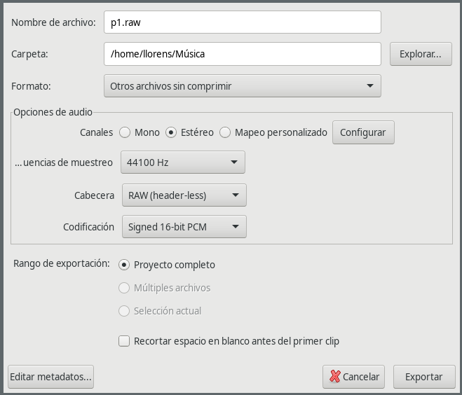

# To Dos

- [ ] Jugar con los bytes y el tiempo, hacer que el reproductor pueda saltar al segundo que yo quiera
- [ ] Aplicar mascaras para hacer que sea mas grabe o mas agudo
- [ ] Jugar con Mono vs Estereo
- [ ] Jugar con los Hz
- [ ] Jugar con el tipo de entero que almacena la informacion

## p1.raw 

### Configuracion



### como escuchar desde vlc

como .raw no tiene ninguna cabecera hay que indicar al reproductor de que tipo de fichero se trata

`--demux=rawaud`: Indica que es audio crudo (sin cabecera)

`--rawaud-channels=1`: Mono (1 canal). Usa 2 si es estéreo

`--rawaud-samplerate=44100`: Frecuencia de muestreo

`--rawaud-fourcc=s16l`: PCM firmado, 16 bits, little endian

```
vlc \
    --demux=rawaud \
    --rawaud-channels=2 \
    --rawaud-samplerate=44100 \
    --rawaud-fourcc=s16l \
    p1.raw
```